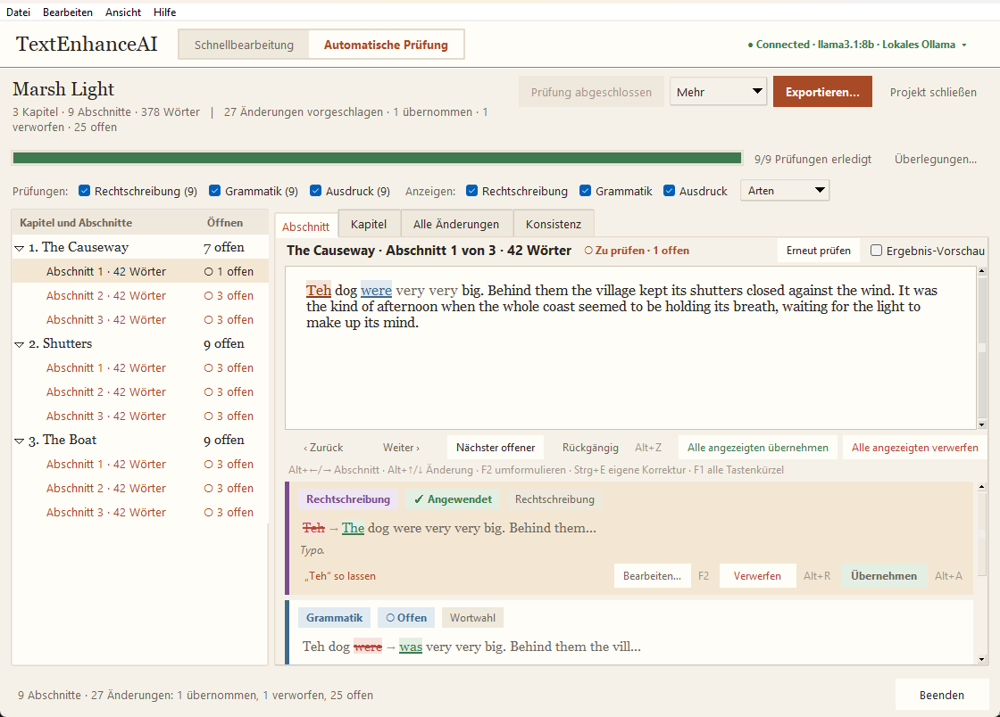

# TextEnhanceAI - Editor with Local LLM Integration

TextEnhanceAI is a privacy-first local desktop editor and manuscript proofreading workbench. It uses [Ollama](https://ollama.com/) or a private self-hosted GPU server ([vLLM](https://github.com/vllm-project/vllm) via a lightweight relay) to proofread, rewrite, copy-edit, and analyze text without sending sensitive content to third-party cloud services.

The application offers two complementary environments:
1. **Quick Editor:** An interactive desktop editor for refining passages sentence-by-sentence across 11 editing modes with word-level diffing and scratchpad logging.
2. **Automatic Manuscript Review:** A full-length book and manuscript proofreading workbench that splits entire manuscripts into chapters and segments, runs multi-pass AI evaluations in the background, detects chapter-spanning inconsistencies, generates deep manuscript analytics, and gives the author granular control over every proposed change.


The same review screen with the German interface (`TEAI_LANG=de` or **Connection... → Language**):



---

## Key Capabilities

### Automatic Manuscript Review Workbench
- **Intelligent Chapter & Segment Splitting:** Automatically detects chapters from Markdown headings, `Chapter` / `Kapitel` patterns, Roman/Arabic numbers, ALL-CAPS titles, or scene breaks (`* * *`), or splits by size / model outline. Segments text into paragraph-aligned chunks (~1,800 characters).
- **Background Multi-Pass Evaluations:** Runs **Spelling**, **Grammar**, and **Expression** checks concurrently in the background. The editor remains fast and responsive; progress is tracked live and projects can be paused, resumed, or closed at any time.
- **Dual Evaluation Modes:**
  - *One combined request per segment (faster):* Uses structured JSON Schema (`response_format`) to extract categorized edits and reasons in a single model call (~1 request per segment).
  - *Three separate requests (more thorough):* Evaluates each check independently across the segment (~3 edit requests per segment). Automatically falls back to separate requests if structured JSON fails or cannot be anchored.
- **Smart Explanation Pipeline:** Rule-based canned explanations handle trivial changes (punctuation, whitespace, capitalization, 1-letter typos) instantly without extra model calls. Remaining changes are batched across up to 6 segments per prompt to minimize token overhead.
- **Author's Style Guide:** Standing instructions (e.g., *British spelling*, *keep dialect inside dialogue*, *never touch quotations*) are injected into every check and explanation prompt, taking precedence over default rules.
- **Protected Glossary & Wildcard Stems:** Protect character names, invented vocabulary, and domain jargon (one per line, with trailing wildcard `*` e.g. `hyper*` to protect all inflections). Proposed changes touching protected terms are automatically suppressed before review. Change cards feature a one-click **Add to glossary** button.
- **Model-Side Hallucination Guard:** Heuristic detection flags changes that look like invented content (excessive text growth, ungrounded vocabulary not present in the segment, or full rewrites during strict spelling/grammar checks). Flagged changes receive an amber *⚠ check this* warning badge with hover explanations, tree glyph indicators, and a one-click **Reject flagged** button.
- **Multi-Tab Review Experience:**
  - **Segment View:** Highlights proposed changes with check-specific colors; presents card-by-card diffs, kind tags, model explanations, and quick decision buttons.
  - **Chapter Reading View:** Continuous full-chapter reading view with live inline annotations (green underline for applied changes, amber background for pending, strikethrough for rejected, amber wave for flagged). Clicking any marked span jumps straight to its card.
  - **All Changes View:** Project-wide tabular browser of all pending changes across chapters. Filter by check, kind, or search string; multi-select rows for bulk acceptance or rejection.
- **Change Classification & Granular Kind Filters:** Every edit is classified into one of 8 distinct kinds: `Whitespace`, `Punctuation`, `Capitalization`, `Spelling`, `Word choice`, `Insertion`, `Deletion`, and `Rewrite`. Hide kinds from view or perform project-wide **Accept all <kind>…** / **Reject all <kind>…** in one click.
- **Inline Editing & Custom Author Corrections:**
  - Press `F2` or click **Edit…** to reword a model proposal before accepting it (marked with ✎).
  - Select any passage in the segment text and press `Ctrl+E` (or right-click → *Add my correction…*) to introduce your own correction with top priority.
- **Chapter-Spanning Consistency Checker:** Scans the entire manuscript across chapters to detect:
  - Proper noun / character name spelling variants (Levenshtein distance ≤ 2, e.g. `Nyxara` vs `Nixara`).
  - Hyphenated vs unhyphenated compound variants (e.g. `E-Mail` vs `Email`).
  - Number style inconsistencies (0–20 written as digits vs spelled-out words in German and English).
  - Mixed quotation-mark styles across chapters.
  - Point of View (POV) and tense drift (detects chapters deviating by >25 percentage points from the manuscript mean).
  - Hybrid workflow: deterministic candidates are gathered immediately; model triages in batches (*issue* vs *intentional*, with preferred forms and rationale); one-click **Apply preferred everywhere** updates all occurrences as author corrections.
- **Deep Manuscript Statistics:** Interactive analytics dialog and exportable Markdown report providing:
  - Per-chapter word counts, total changes, change density (changes per 1,000 words), and acceptance counts.
  - Per-check and per-kind totals, change frequencies, and author acceptance rates.
  - Top 20 most frequent recurring substitutions across the manuscript (double-click to jump to the first occurrence).
  - One-click **Copy as Markdown** to clipboard.
- **External Source Re-Sync (`Check source`):** If the `.txt` manuscript is edited externally, TextEnhanceAI re-splits the file, seamlessly keeps all existing results and decisions on unchanged segments, queues modified segments for evaluation, and safely archives dropped segments' changes into `resync-<timestamp>.md`.
- **Full Multi-Level Undo & Persistent Audit Trail:** Every decision (single card, bulk accept/reject, kind actions, flagged rejections, or consistency replacements) can be undone via `Alt+Z`. A persistent decision log is saved in `project.json` and viewable via the **Decisions...** dialog.
- **Granular Re-evaluation:** Re-run all checks, an individual check (e.g. just Expression), or an entire chapter on demand via right-click tree context menus or segment headers.
- **Clean Export & Audit Reports:** Exports clean chapter files (`reviewed/NN - Title.txt`), a unified full manuscript (`<name>-reviewed.txt`), and a detailed Markdown report (`report.md`) containing options, change tables, decisions, glossary suppressions, hallucination warnings, and statistics.

---

### Interactive Quick Editor
- **Sentence-by-Sentence Review:** Inspect edits sentence by sentence instead of wrestling with cluttered inline text diffs.
- **Word-Level Change Groups:** Expand any sentence to accept or reject individual words, phrases, or punctuation changes.
- **11 Editing Modes:** Grammar, Proofread, Natural, Streamline, Awkward, Rewrite, Concise, Polish, Improve, Translate, and Custom prompt instructions.
- **Non-Destructive & Safe:** The original text remains untouched while suggestions are evaluated. Suggestions are only applied when all changes have decisions.
- **Instant Scratchpad History:** Every generated proposal, decision breakdown, and final applied output is recorded into local Markdown scratchpads (`TextEnhanceAI-scratchpad_*.md`).

---

### Architecture, Privacy & Performance
- **Zero Third-Party Cloud Dependencies:** Run completely offline using local models via Ollama or over an encrypted private tunnel to your own GPU server. No manuscript text is ever logged on intermediate relays.
- **Remote GPU Support (Relay + vLLM):** Connect to a powerful remote GPU server (e.g. hosting a 27B+ parameter model) through an outbound-only reverse relay—no public ports or inbound firewall holes required.
- **Prefix Caching Optimization:** Review prompts place manuscript text before instructions (`text_first=True`) so vLLM and caching-enabled backends maximize KV-cache reuse across checks of the same segment.
- **Multi-Language UI (i18n):** The complete user interface is available in English and German (`locales/de.json`), following the system language or the choice in the Connection dialog; model prompts stay English and explanation language remains a per-project option.
- **Accessibility:** Every state is shown as a glyph plus a word, never by colour alone (tree rows, change cards, the chapter view's optional `[+]`/`[~]`/`[−]` markers, the quick review's removed/added labels). The View menu (and `Ctrl+=` / `Ctrl+-` / `Ctrl+0`) scales every font from 80 % to 200 %, and **High contrast** switches to a black-on-white palette with thick borders and a yellow selection; both are remembered. Cards, links and dialogs are reachable with Tab; the selected card carries a visible focus border.
- **Live Model Thinking:** **View → Model thinking...** (`Ctrl+Shift+T`, also the **Thinking...** button next to *Cancel* and in the review's progress row) opens a window that shows the reasoning a thinking model streams while it works — one entry per request (quick edit steps, every check of every segment, explanation batches, the consistency check), newest first, with its state (waiting / thinking / answering / done / failed / cancelled) and character counts. It works with vLLM's reasoning parser (`reasoning_content`), Ollama's `thinking` field (Ollama 0.9+) and models that write `<think>` blocks inline; the edited text never contains the reasoning. Nothing is written to disk.
- **Persistent State:** Projects are saved in `<manuscript>.teai/project.json` after every decision, ensuring zero progress loss on application restart.

---

## Requirements

- **Python:** 3.8 or newer
- **Backend (choose one or both):**
  - **Local Ollama:** [Ollama](https://ollama.com/) installed and running locally with at least one model pulled.
  - **Remote GPU Server:** Self-hosted relay and GPU agent running vLLM (see [Remote GPU models](#remote-gpu-models-through-your-own-relay)).

### Recommended Models

- **Standard Desktop GPU (6–8 GB VRAM):** `ollama pull llama3.1:8b`
- **Resource-Constrained / CPU-Only:** `ollama pull qwen3:1.7b`
- **Dedicated GPU Server:** Qwen 2.5 27B / 32B or Llama 3.1 70B via vLLM

The app defaults to `llama3.1:8b`. Select installed models from the **Model** dropdown or override the default via the `TEAI_MODEL` environment variable.

---

## Installation & Launch

Clone the repository and install the standard dependencies:

```powershell
pip install -r requirements.txt
python TextEnhanceAI.py
```

Using [`uv`](https://github.com/astral-sh/uv) is supported and recommended:

```powershell
uv venv
uv pip install -r requirements.txt
uv run python TextEnhanceAI.py
```

---

## Automatic Manuscript Review Walkthrough

Switch to **Automatic review** in the top header to proofread a full book, paper, or multi-chapter document.

```
┌──────────────────────────────────────────────────────────────────────────────────┐
│  [Editor]  [Automatic review]                         Backend: Local (Ollama) ▾  │
├──────────────────────────────────────────────────────────────────────────────────┤
│ Project: MyNovel.txt                                [Options...] [Consistency...]│
├───────────────────────┬──────────────────────────────────────────────────────────┤
│ Chapters & Segments   │ [Segment]  [Chapter]  [All changes]  [Consistency]       │
│ ├─ Chapter 1 (✓)      │ ──────────────────────────────────────────────────────── │
│ │  ├─ Segment 1 (✓)   │ Text with highlighted changes...                         │
│ │  └─ Segment 2 (●)   │ ──────────────────────────────────────────────────────── │
│ └─ Chapter 2 (○)      │ Change Cards: Before / After Diff + Model Explanation    │
│                       │ [Accept (Alt+A)] [Reject (Alt+R)] [Edit (F2)]            │
└───────────────────────┴──────────────────────────────────────────────────────────┘
```

### 1. Open a Manuscript
Choose any `.txt` file. The start screen previews chapter detection:
- Recognizes Markdown headers (`#`, `##`), `Chapter N` / `Kapitel N` headings, numbered titles, ALL-CAPS titles, and scene dividers (`* * *`).
- Texts lacking headings can be split evenly by size, or you can ask the model to generate a chapter outline based on content.

### 2. Configure Options & Style Guide
- **Checks:** Toggle **Spelling**, **Grammar**, and **Expression** independently.
- **Author's instructions:** Set standing style rules (e.g. `British spelling`, `keep dialect inside dialogue`, `never touch quotations`). These are sent with all check and explanation prompts.
- **Protected terms (Glossary):** Add character names, invented languages, and technical terms (one per line, e.g. `Thalbrück`, `hyper*`). Wildcard `*` protects any suffix. Any model change touching these words is dropped.
- **Evaluation mode:**
  - *One combined request per segment (faster):* Uses structured JSON Schema output (~1 request per segment).
  - *Three separate requests (more thorough):* Evaluates each check independently, using explanation batching and canned explanations for minor fixes.

### 3. Background Evaluation
Press **Start review**. The evaluation runs in the background across configurable worker threads. Segments become available for review immediately as they complete. You can pause, close the application, and resume anytime—all state is continuously saved in `<manuscript>.teai/project.json`.

### 4. Review Across Multiple Tabs
- **Segment Tab:**
  - Inspect proposed changes highlighted directly in the segment text.
  - Review change cards showing before/after diffs, change kind tags, and model explanations.
  - Press `Alt+A` to accept, `Alt+R` to reject, or `F2` to reword inline.
  - Select text and press `Ctrl+E` to add an author correction.
  - Use **Kinds ▾** to filter visible change kinds or bulk accept/reject by kind across the project.
  - Use **Reject flagged ⚠** to discard suspicious additions caught by the hallucination guard.
- **Chapter Tab:**
  - Read through the full chapter with color-coded live annotations (green underline = applied, amber background = pending, strikethrough = rejected, amber highlight = flagged).
  - Click any highlighted passage to jump directly to its segment and change card.
- **All Changes Tab:**
  - Browse a project-wide table of all pending changes.
  - Filter by check type, change kind, or search text. Multi-select rows to accept or reject in bulk.
- **Undo (`Alt+Z`):** Revert any decision—single changes or bulk operations—in a single step. View the complete history via **Decisions...**.

### 5. Chapter-Spanning Consistency Check
Once all segments are evaluated, open **Consistency...**:
- Scans the manuscript for inconsistent name spellings (`Nyxara`/`Nixara`), hyphenated compounds (`E-Mail`/`Email`), number styles (0–20 digits vs words), quotation marks, and POV/tense shifts.
- Inspect model-triaged findings in the **Consistency** tab.
- Click **Apply preferred everywhere** to replace all variants across the entire manuscript with a single click (fully undoable).

### 6. Analytics & Source Re-sync
- **Statistics...:** Review per-chapter change densities, acceptance rates, and the 20 most frequent corrections. Click **Copy as Markdown** to export tables.
- **Check source:** If you edited the source `.txt` file externally, re-sync to preserve existing decisions on unchanged segments and evaluate only updated text. Dropped segment changes are safely preserved in `resync-<timestamp>.md`.

### 7. Export
Click **Export...** to produce:
- `reviewed/NN - Title.txt` for each individual chapter.
- `<manuscript>-reviewed.txt` containing the full unified manuscript.
- `report.md` summarizing options, decisions, statistics, glossary suppressions, and flagged items.

---

## Quick Editor Workflow

1. Paste or type text into the editor.
2. Select an editing mode (e.g. *Grammar*, *Concise*, *Polish*, *Custom*) and your desired model.
3. Click **Review changes** or press `Ctrl+Enter`.
4. Review changes sentence-by-sentence with clear visual diffs:
   - Accept or reject whole sentences, or expand **Review individual changes** to decide word by word.
   - Use **Previous** and **Next** (`Alt+Left` / `Alt+Right`) to step through proposals.
5. Click **Apply review** once all decisions are made.
6. Use **Undo** if you want to restore the previous editor text.

---

## Keyboard Shortcuts Reference

| Shortcut | Context | Action |
| :--- | :--- | :--- |
| `Ctrl+Enter` | Quick Editor / Review | Generate suggestions or apply completed review |
| `Alt+A` | Quick Editor / Review | Accept current sentence / selected change |
| `Alt+R` | Quick Editor / Review | Reject current sentence / selected change |
| `Alt+Z` | Review Workflow | Undo the last decision (single or bulk action) |
| `F2` | Review Workflow | Edit / reword the selected suggestion inline |
| `Ctrl+E` | Review Workflow | Add custom author correction for selected text |
| `Ctrl+Shift+T` | Everywhere | Open the *Model thinking* window (live reasoning of the running requests) |
| `Alt+Left` / `Alt+Right` | Quick Editor / Review | Navigate previous / next suggestion or segment |
| `Alt+Up` / `Alt+Down` | Review Workflow | Select previous / next change card |

---

## Remote GPU Models (Through Your Own Relay)

For maximum speed and quality, TextEnhanceAI can connect to an external GPU server hosting large open models (such as Qwen 2.5 27B or Llama 3.1 70B) behind a firewall:

- **Relay (`remote/relay`):** A lightweight reverse-proxy server deployed via Docker Compose with automatic HTTPS. The GPU server and desktop clients connect to this relay; no incoming ports need to be opened on your GPU machine.
- **GPU Agent (`remote/gpu-agent`):** Docker Compose stack running [vLLM](https://github.com/vllm-project/vllm) and a lightweight tunneling agent that registers with the relay using an API key.
- **Zero Text Logging:** Neither the relay nor the agent ever logs prompt text or output content.
- **Fast Cancellation:** Clicking Cancel in the desktop UI aborts remote generation immediately, freeing GPU compute.
- **Configuration:** In TextEnhanceAI, select **Connection...**, choose **Remote GPU (relay)**, enter your relay URL and client key, test the connection, and save.

Complete deployment instructions and wire protocol documentation are in [remote/README.md](remote/README.md) and [remote/PROTOCOL.md](remote/PROTOCOL.md).

Settings are stored in `TextEnhanceAI-settings.json` (ignored by Git). Environment variables can seed initial settings:
`TEAI_BACKEND`, `TEAI_REMOTE_URL`, `TEAI_REMOTE_API_KEY`, `TEAI_REMOTE_MAX_TOKENS`, `TEAI_REMOTE_THINKING`, `TEAI_LANG`, `TEAI_UI_SCALE`, `TEAI_HIGH_CONTRAST`, and `TEAI_MODEL`.

---

## Development & Automated Tests

### Codebase Organization
- `TextEnhanceAI.py`: Application launcher.
- `core/`: Pure editing logic, backends, and review engine (independent of Tkinter for headless testing):
  - `backend.py`: Abstract LLM backend interface and prompt builders.
  - `ollama_service.py` & `remote_service.py`: Ollama and remote relay implementations.
  - `chunking.py`: Document reading and chapter/segment splitting heuristics.
  - `workflow.py`: Manuscript review project model, background runner, merge rules, and reporting.
  - `change_kinds.py`: Heuristic classification of edits into 8 distinct kinds.
  - `consistency.py`: Chapter-spanning consistency analysis and model triage.
  - `statistics.py`: Word counts, change densities, and correction frequencies.
  - `settings.py`: Persisted application configuration.
- `ui/`: Tkinter interface components:
  - `app.py`: Main application window and Quick Editor screen.
  - `review_panel.py`: Sentence and word-group review panel.
  - `workflow_screen.py`: Automatic manuscript review views, cards, tabs, and dialogs.
  - `connection_dialog.py`: Backend and model selection dialog.
  - `thinking_window.py`: Live view of the reasoning every request streams (`StreamLog` model + window).
  - `theme.py`: Design tokens, colors, custom widgets, and styling.
  - `i18n.py`: Internationalization helper.
- `locales/`: UI localization dictionaries (`de.json`).
- `remote/`: Docker Compose stacks for the public relay and GPU agent.
- `tests/`: Automated unit and integration test suite.

### Running Tests

Install development dependencies and run pytest:

```powershell
uv pip install -r requirements-dev.txt
uv run pytest -q
```

The test suite runs completely offline using simulated backends and recorded response cassettes (`tests/recorded/`), requiring no live Ollama or remote server. Re-recording live model responses for new prompts or samples is done via `python scripts/record_responses.py`.

---

## Contact

**Email:** [wenrolland@designecologique.ca](mailto:wenrolland@designecologique.ca)

---

## Updates & Changelog

- **Current Capabilities (Manuscript Review & Consistency):**
  - Added full chapter-spanning consistency analysis (character names, hyphenation, numbers 0–20, quotes, POV/tense shift detection) with LLM triage and one-click manuscript-wide resolution.
  - Added multi-tab review layout: *Segment* card view, *Chapter* continuous reading view with live annotations, and *All changes* project-wide pending changes table.
  - Added deep manuscript statistics (per-chapter metrics, change density per 1,000 words, acceptance rates, top-20 recurring corrections, Markdown export).
  - Added external source synchronization (`Check source`) preserving decisions on untouched text and archiving dropped edits.
  - Added author inline suggestion editing (`F2`) and custom author corrections (`Ctrl+E`).
  - Added persistent decision audit log and full multi-level undo (`Alt+Z`).
  - Added change-kind classification into 8 distinct edit types with kind-based filtering and project-wide bulk actions.
  - Added dual evaluation modes (single combined JSON-schema pass vs three separate passes) with automatic fallback.
  - Added explanation optimizations (rule-based canned explanations for trivial edits, multi-segment explanation batching).
  - Added model-side hallucination guard flagging suspicious expansions with amber warning badges and one-click bulk rejection.
  - Added author style guide and protected glossary lists with wildcard stem protection (`*`).
  - Added prompt ordering optimization for server-side KV prefix caching.
  - Added multi-language UI framework (English and German) and a complete German translation.
  - Added an accessibility pass: glyph-plus-word states, chapter-view text markers, font scaling (`Ctrl+=` / `Ctrl+-` / `Ctrl+0`), a high-contrast palette and keyboard-reachable cards.
  - Added opt-in long-run stability tests (`pytest -m slow -q`) for the evaluation runner and the relay path.
  - Added a live **Model thinking** window (`Ctrl+Shift+T`) that shows the reasoning of every running request as it streams, for the quick editor, the automatic review and the consistency check.
- **Version 0.13:** Added structured sentence and word-group review, safe mixed decisions, cancellation, connection status, enhanced scratchpads, undo, and automated tests.
- **Version 0.12:** Added local model selection and background generation.
- **Version 0.11:** Preserved line breaks after editing.

